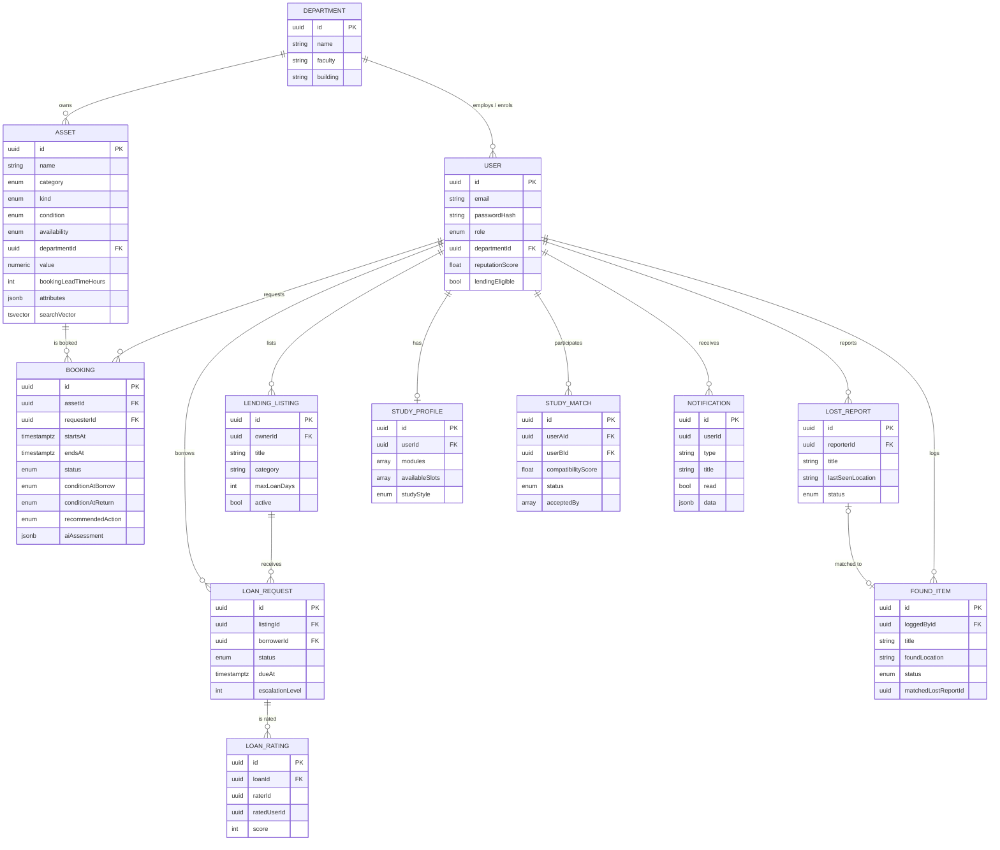

# CampusLoop - System Design Document (Deliverable 1)

> **Team:** Unemployed Developers - Aftab Ahmed Samoo (#2312398), Javeria Masroor (#2312400), Laiba Aamir (#2312398)
> **Course:** Web Technologies · Instructor: Mustafa Hassan · SZABIST
>
> ⚠️ Per the course's Academic Integrity policy (spec §8), AI tools may not be used to *write* this
> document. This file is a **technical draft/skeleton generated from the implemented codebase** -
> the team must review, verify and rewrite it in their own words before submission.

## 1. Entity-Relationship Diagram



### Polymorphic asset modelling
One `assets` table models three kinds (`PHYSICAL_ITEM`, `ROOM`, `LOANABLE_GOOD`) via a `kind`
discriminator plus a JSONB `attributes` bag (room capacity, ISBN, serial number…). This keeps
booking/search/analytics logic uniform while allowing kind-specific data.

### Concurrency safety (two layers)
1. **Application:** bookings are created inside a transaction that takes a `SELECT … FOR UPDATE`
   pessimistic lock on the asset row, then checks overlap (`startsAt < :endsAt AND endsAt > :startsAt`).
2. **Database:** an **exclusion constraint** (`btree_gist`, `tstzrange && overlap` on active statuses)
   guarantees no double-booking can be committed even if application code regresses.

## 2. API Contract

Swagger auto-generates the authoritative, always-accurate contract at **`/api`**. Summary:

| Method | Path | Roles | Purpose |
|---|---|---|---|
| POST | /auth/register | public | Register; returns access+refresh pair |
| POST | /auth/login | public | Login |
| POST | /auth/refresh | public | Rotate token pair |
| POST | /auth/logout | any | Revoke refresh token |
| GET | /users/me | any | Own profile |
| GET | /users | ADMIN | List users |
| PATCH | /users/:id/role | ADMIN | Change role |
| GET | /departments | public | List departments |
| POST | /departments | ADMIN | Create department |
| GET | /assets | any | Catalogue w/ full-text search, filters, paging |
| GET | /assets/:id | any | Asset detail |
| POST | /assets | STAFF, ADMIN | Create (multipart, photo required) |
| PATCH | /assets/:id | STAFF, ADMIN | Update |
| PATCH | /assets/:id/transfer | ADMIN | Transfer between departments |
| DELETE | /assets/:id | STAFF, ADMIN | Delete |
| POST | /bookings | any | Create booking (conflict-safe) |
| GET | /bookings/availability/:assetId | any | Booked slots in range |
| GET | /bookings/mine | any | My bookings |
| GET | /bookings/pending | STAFF, ADMIN | Approval queue (dept-scoped) |
| GET | /bookings/inspections | STAFF, ADMIN | Returns awaiting inspection |
| PATCH | /bookings/:id/decision | STAFF, ADMIN | Approve/decline → WS notify |
| POST | /bookings/:id/return | any | Return w/ photo → AI assessment |
| PATCH | /bookings/:id/inspection | STAFF, ADMIN | Confirm/override AI report |
| GET | /lending/listings | any | Marketplace |
| POST | /lending/listings | any (rep ≥ 2.5) | List item |
| POST | /lending/loans/:listingId/request | any | Request loan |
| PATCH | /lending/loans/:id/decision | owner | Accept/decline |
| PATCH | /lending/loans/:id/return | owner | Mark returned |
| POST | /lending/loans/:id/rate | both parties | Mutual rating |
| GET | /lending/loans/mine · /incoming | any | Borrowed / lent |
| POST | /lost-found/lost | any | Report lost (multipart) |
| POST | /lost-found/found | OFFICER, ADMIN | Log found (multipart) |
| GET | /lost-found/lost · /found | any | Lists |
| GET | /lost-found/matches | OFFICER, ADMIN | AI-suggested pairs |
| POST | /lost-found/matches/confirm | OFFICER, ADMIN | Confirm pair → WS notify |
| PATCH | /lost-found/found/:id/returned | OFFICER, ADMIN | Returned to owner |
| POST | /study/profile · GET /study/profile | any | Study profile |
| GET | /study/matches/suggest | any | AI Feature 3 ranking |
| POST | /study/matches/propose | any | Propose (WS notify) |
| PATCH | /study/matches/:id/respond | party | Accept/decline (both-accept gate) |
| GET | /study/matches | any | My matches (emails hidden until CONFIRMED) |
| POST | /ai/smart-search | any | AI Feature 1 (proxied) |
| GET | /analytics/* | ADMIN | overview, utilisation, demand, turnaround, lending, anomaly-report |
| GET | /notifications · PATCH :id/read · read-all | any | In-app notifications |

**WebSocket events** (Socket.io, JWT handshake; rooms `user:<id>`, `role:<role>`, `dept:<id>`):
`notification`, `booking:pending`, `inspection:pending`, `lostfound:new-report`, `anomaly-report`.

## 3. React Component Tree (role visibility)

```
App (theme, socket lifecycle, AnimatePresence)
├── Aurora (ambient background)          - all
├── NavBar (role-aware links, bell, theme) - all
├── Toasts                                - all
└── Routes
    ├── / Landing · /about About · /login · /register        - public
    └── Protected (redirect → /login)
        ├── /app        RoleHome → Discover (AI search)      - STUDENT
        ├── /app/catalogue  Catalogue (+AddAssetModal ▸ STAFF/ADMIN)
        ├── /app/assets/:id AssetDetail (slot calendar)      - all roles
        ├── /app/bookings   Bookings (+ReturnModal, AI result)
        ├── /app/lending    Lending (tabs, Rate/Add modals)  - STUDENT
        ├── /app/lost-found LostFound (AI-matches tab ▸ OFFICER/ADMIN)
        ├── /app/study      StudyGroups (profile, AI suggest)- STUDENT
        ├── /app/manage     Manage (approvals + InspectionModal) - STAFF/ADMIN
        ├── /app/admin      AdminDashboard (4 chart types + anomaly) - ADMIN
        └── /app/users      UsersAdmin (role editor)         - ADMIN
```

State: **Zustand** stores (`auth` persisted, `ui` theme/toasts, `notifications` socket) + local
component state; React Context is provided by the router/theme layer. Axios interceptor performs
silent refresh-token rotation.

## 4. AI Integration Architecture

```
React UI ──(REST, JWT)──▶ NestJS AI Proxy (AiModule) ──(HTTPS, API key)──▶ Anthropic / OpenAI
                              │
                              ├── prompts.ts      (versioned templates, JSON-only outputs)
                              ├── llm.client.ts   (provider-agnostic, 30s timeout, null on failure)
                              └── ai.service.ts   (context building + validation + fallbacks)
```

- **Prompt structure:** system prompt fixes role, rules, and a strict JSON schema; user prompt
  injects compact JSON context (catalogue slice, profiles, stats). Full templates: `docs/AI_INTEGRATION_REPORT.md`.
- **Context management:** context is *narrowed server-side* (max 120 assets, trimmed descriptions,
  pre-computed typical booking durations) to bound token usage; images are base64-attached only
  for condition assessment.
- **Output handling:** first JSON block is parsed; every enum/id is validated against the database
  before use (LLM cannot invent asset ids - invalid ids are dropped).
- **Fallbacks (graceful degradation):**
  - Smart search → PostgreSQL full-text keyword search, `aiRanked:false` flag shown in UI
  - Condition assessment → no pre-fill; manager fills the form manually
  - Study matcher → deterministic module/slot-overlap scoring
  - Lost&Found matcher → token-overlap heuristic
  - Anomaly detector → run skipped, logged; UI explains
- **Security:** API keys only in backend `.env`; frontend has zero AI credentials (constraint 5.1).
